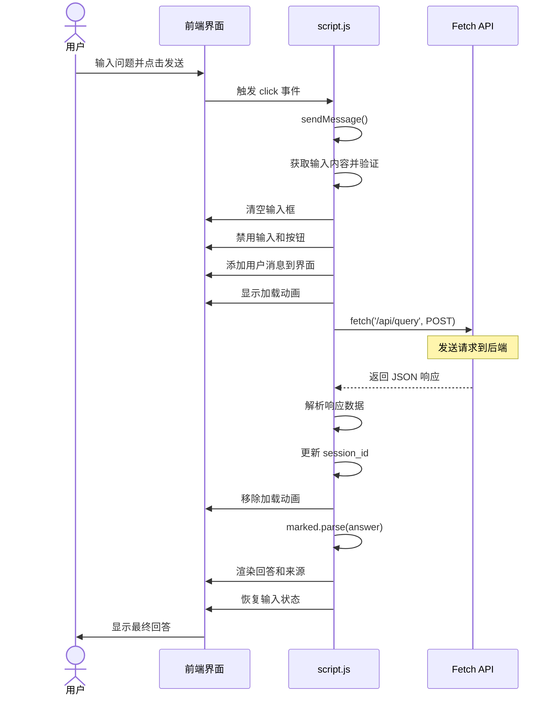
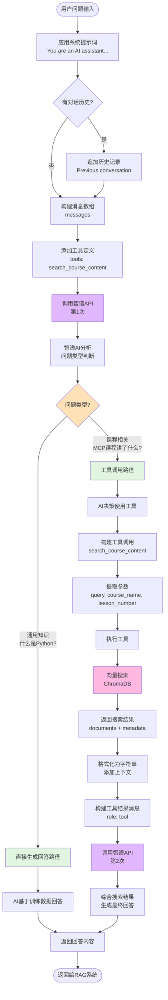
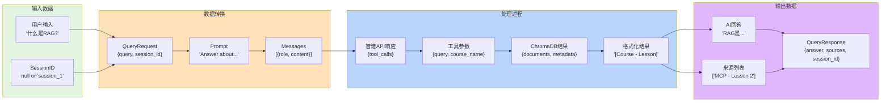
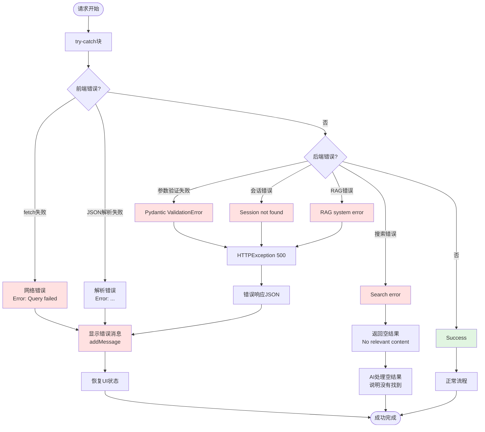
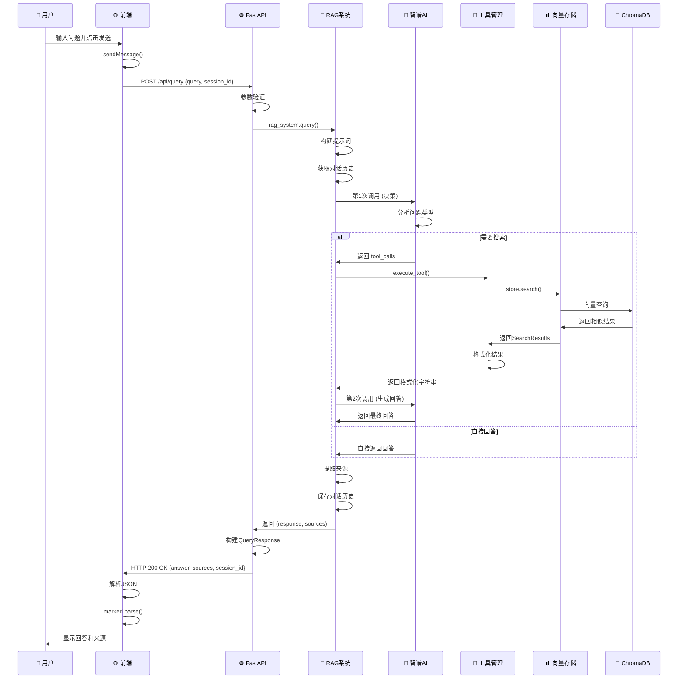
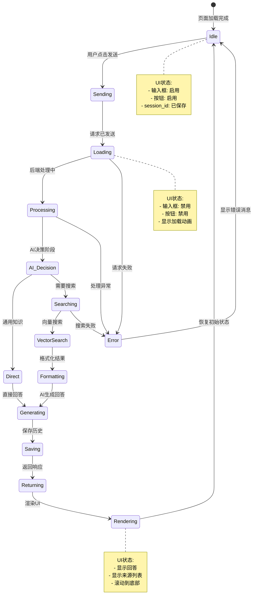
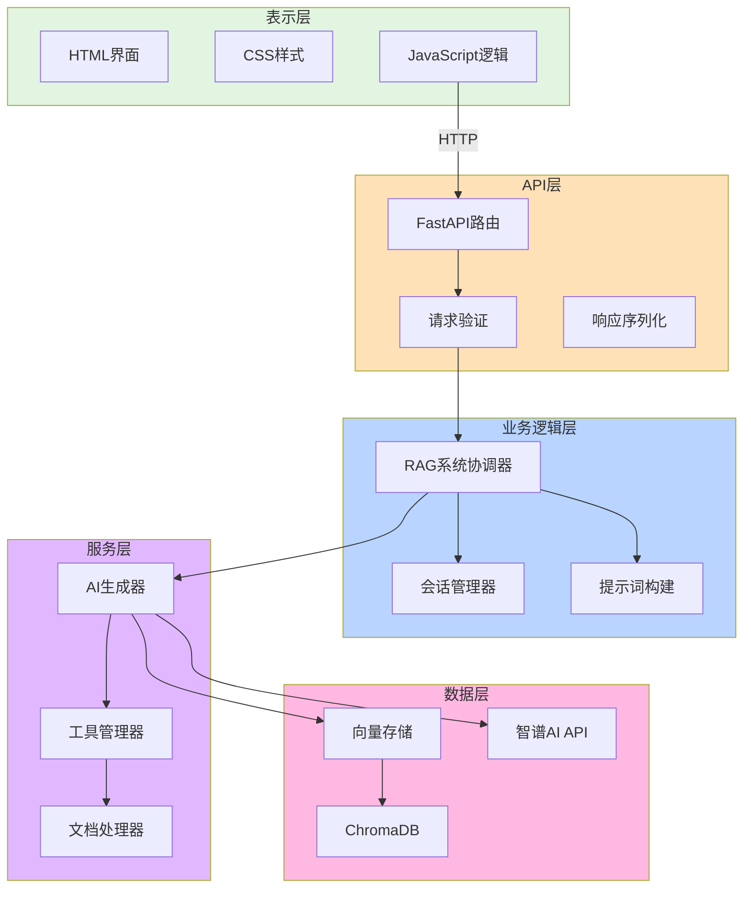

# 用户查询完整流程图

## 1. 端到端主流程图

```mermaid
flowchart TD
    Start([用户输入问题]) --> UI_GetValue[获取输入框内容<br/>chatInput.value]
    UI_GetValue --> UI_Check{内容为空?}
    UI_Check -->|是| End1([结束])
    UI_Check -->|否| UI_Disable[禁用输入和按钮<br/>显示加载动画]

    UI_Disable --> UI_AddMsg[添加用户消息到界面]
    UI_AddMsg --> Fetch[发送HTTP POST请求<br/>/api/query]

    Fetch -->|Request| Backend[FastAPI后端接收]
    Backend --> Validate[Pydantic参数验证<br/>QueryRequest]
    Validate --> Session_Check{session_id存在?}

    Session_Check -->|否| Create_Session[创建新会话<br/>session_manager.create_session]
    Session_Check -->|是| RAG_Query
    Create_Session --> RAG_Query[RAG系统处理<br/>rag_system.query]

    RAG_Query --> Build_Prompt[构建提示词<br/>Answer about course materials]
    Build_Prompt --> Get_History[获取对话历史<br/>session_manager.get_history]

    Get_History --> AI_Call_1[调用智谱AI<br/>第1次:决策阶段]
    AI_Call_1 --> Zhipu_API_1[智谱API处理<br/>分析问题类型]

    Zhipu_API_1 --> AI_Decision{需要搜索?}
    AI_Decision -->|否<br/>通用知识| Direct_Response[AI直接回答<br/>response.content]
    AI_Decision -->|是<br/>课程相关| Tool_Execute[执行工具调用<br/>tool_manager.execute_tool]

    Tool_Execute --> CourseSearch[课程搜索工具<br/>CourseSearchTool.execute]
    CourseSearch --> Vector_Search[向量存储搜索<br/>VectorStore.search]

    Vector_Search --> ChromaDB[ChromaDB查询<br/>语义相似度计算]
    ChromaDB --> Search_Results[返回搜索结果<br/>SearchResults]

    Search_Results --> Format_Results[格式化结果<br/>添加上下文前缀]
    Format_Results --> Track_Sources[记录来源信息<br/>last_sources]

    Track_Sources --> AI_Call_2[调用智谱AI<br/>第2次:生成回答]
    AI_Call_2 --> Zhipu_API_2[智谱API处理<br/>综合搜索结果生成回答]

    Zhipu_API_2 --> Final_Response[获取最终回答<br/>response.content]
    Direct_Response --> Extract_Sources
    Final_Response --> Extract_Sources[提取来源列表<br/>tool_manager.get_last_sources]

    Extract_Sources --> Save_History[保存对话历史<br/>session_manager.add_exchange]
    Save_History --> Build_Response[构建响应对象<br/>QueryResponse]

    Build_Response --> Serialize[序列化为JSON<br/>FastAPI自动处理]
    Serialize --> |Response| HTTP_Response[HTTP 200 OK]

    HTTP_Response --> Fetch_Receive[前端接收响应<br/>response.json]
    Fetch_Receive --> Update_Session[更新会话ID<br/>currentSessionId]

    Update_Session --> Remove_Loading[移除加载动画]
    Remove_Loading --> Parse_Markdown[解析Markdown<br/>marked.parse]

    Parse_Markdown --> Build_HTML[构建消息HTML<br/>添加来源列表]
    Build_HTML --> Render_DOM[渲染到页面<br/>插入DOM]

    Render_DOM --> Restore_State[恢复UI状态<br/>启用输入和按钮]
    Restore_State --> End2([完成✅])

    style Start fill:#e1f5e1
    style End2 fill:#e1f5e1
    style End1 fill:#ffe1e1
    style Fetch fill:#ffe1b8
    style Backend fill:#b8d4ff
    style AI_Call_1 fill:#e1b8ff
    style AI_Call_2 fill:#e1b8ff
    style ChromaDB fill:#ffb8e1
    style Zhipu_API_1 fill:#e1b8ff
    style Zhipu_API_2 fill:#e1b8ff
```



---

## 2. 前端交互详细流程



---

## 3. 后端处理详细流程

```mermaid
flowchart TD
    subgraph Frontend ["前端层"]
        A1[用户输入] --> A2[sendMessage]
        A2 --> A3[fetch POST /api/query]
    end

    subgraph Backend ["后端层"]
        B1[FastAPI路由] --> B2[query_documents]
        B2 --> B3[参数验证 QueryRequest]
        B3 --> B4{session_id?}
        B4 -->|否| B5[创建会话]
        B4 -->|是| B6[RAGSystem.query]
        B5 --> B6
    end

    subgraph RAG ["RAG系统层"]
        C1[RAGSystem] --> C2[构建提示词]
        C2 --> C3[获取历史记录]
        C3 --> C4[AI生成器]
    end

    subgraph AI ["AI决策层"]
        D1[AIGenerator] --> D2[第1次智谱API调用]
        D2 --> D3{需要搜索?}
        D3 -->|否| D4[直接回答]
        D3 -->|是| D5[工具执行]
    end

    subgraph Search ["搜索层"]
        E1[ToolManager] --> E2[CourseSearchTool]
        E2 --> E3[VectorStore]
        E3 --> E4[ChromaDB]
        E4 --> E5[向量相似度计算]
        E5 --> E6[返回Top-K结果]
    end

    subgraph Response ["响应层"]
        F1[格式化搜索结果] --> F2[第2次智谱API调用]
        F2 --> F3[生成最终回答]
        F3 --> F4[提取来源]
        F4 --> F5[保存历史]
        F5 --> F6[构建QueryResponse]
    end

    subgraph Return ["返回层"]
        G1[序列化JSON] --> G2[HTTP 200 OK]
        G2 --> G3[前端接收]
        G3 --> G4[渲染UI]
    end

    A3 -.->|HTTP| B1
    B6 -.->|调用| C1
    C4 -.->|调用| D1
    D5 -.->|执行| E1
    E6 -.->|返回| F1
    F6 -.->|HTTP响应| G1
```



---

## 4. AI工具调用决策流程



---

## 5. 向量搜索详细流程

```mermaid
flowchart TD
    Start([搜索请求<br/>search_course_content]) --> Parse_Params[解析参数<br/>query, course_name, lesson_number]

    Parse_Params --> Check_Course{有course_name?}
    Check_Course -->|是| Resolve_Course[解析课程名<br/>_resolve_course_name]
    Check_Course -->|否| Build_Filter

    Resolve_Course --> Catalog_Search[搜索course_catalog<br/>模糊匹配]
    Catalog_Search --> Found_Course{找到匹配?}
    Found_Course -->|否| Return_Error[返回错误<br/>No course found]
    Found_Course -->|是| Get_Title[获取精确课程标题<br/>course_title]
    Get_Title --> Build_Filter

    Build_Filter[构建过滤器<br/>_build_filter] --> Check_Lesson{有lesson_number?}
    Check_Lesson -->|有| Combined_Filter[组合过滤器<br/>$and: course_title + lesson_number]
    Check_Lesson -->|无| Single_Filter[单一过滤器<br/>course_title or None]

    Combined_Filter --> Chroma_Query
    Single_Filter --> Chroma_Query[ChromaDB查询<br/>course_content.query]

    Chroma_Query --> Encode_Query[向量化查询<br/>SentenceTransformer]
    Encode_Query --> Calc_Similarity[计算相似度<br/>Cosine Similarity]
    Calc_Similarity --> Apply_Filter[应用元数据过滤<br/>where: filter_dict]
    Apply_Filter --> Top_K[返回Top-K结果<br/>默认K=5]

    Top_K --> Build_Results[构建SearchResults<br/>documents + metadata + distances]
    Build_Results --> Return_Results[返回给搜索工具]

    Return_Results --> Format[格式化结果<br/>_format_results]
    Format --> Add_Context[添加上下文前缀<br/>[Course - Lesson X]]
    Add_Context --> Track_Sources[记录来源<br/>last_sources]
    Track_Sources --> Return_Formatted[返回格式化字符串]

    Return_Formatted --> End([返回给AI])

    style Resolve_Course fill:#b8d4ff
    style Chroma_Query fill:#ffb8e1
    style Encode_Query fill:#e1b8ff
    style Calc_Similarity fill:#ffe1b8
```

---

## 6. 数据结构流转图



---

## 7. 异常处理流程



---

## 8. 时序图：完整交互流程



---

## 9. 状态流转图



---

## 10. 架构层次图



---

## 使用说明

这些流程图可以用以下方式查看：

1. **GitHub/GitLab**: 直接在README.md中渲染
2. **Notion**: 复制Mermaid代码块
3. **VS Code**: 安装Mermaid插件预览
4. **在线编辑器**: https://mermaid.live

所有图表均基于真实代码路径绘制，准确反映了当前系统的执行流程。
